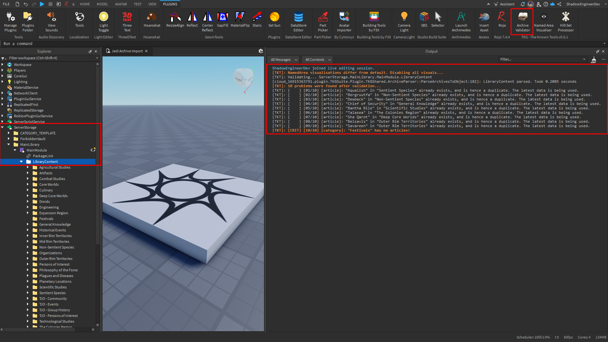
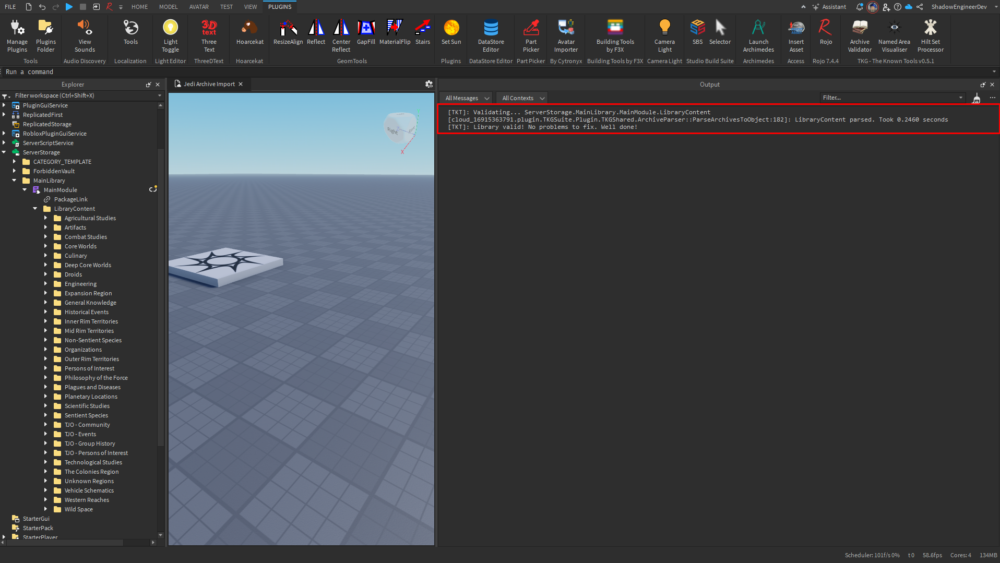

# Archive Validator
Validates a given folder containing archive data against the expected structure TKG games expect.

The simple workflow is:
1. [Select](#choosing-what-archives-to-validate) what archives you want to validate.
2. Press the validator button in the TKT widget in the Plugins tab.
3. [View](#viewing-validation-results) results.

What exact rules the validator checks against are not worth documenting here, for they might change at any given point during TKG development.
Any problems with rules not being met will be Outputted, and a Loremaster (likely you, since you're reading this guide) will need to fix them.
The problem messages should be quite verbose and easy to understand - they pinpoint exactly what object is having the problem and what the problem is.

:::tip
You can key-bind the toggle (to something useful like `ALT+V`) using the Studio Shortcut manager!

Simply navigate `File > Advanced > Customize Shortcuts...` and in the pop-up window that opens, search for `Archive`.
Then, bind to what you find most comfortable!
:::
## Choosing What Archives to Validate
The plugin will look for archives to validate in 2 places:
1. Your selection, based on the following rules:
    - Whatever you select **must be a** `Folder`.
    - You must only have **1 item in your selection**.
2. Looking for a `Folder` down the following path: `ServerStorage > MainLibrary > MainModule > LibraryContent`
    - Note that `MainLibrary` and `LibraryContent` must both be `Folder`s
    - And `MainModule` must be a `ModuleScript`. Whether it is a package or not is irrelevant.
## Viewing Validation Results
Results will show up in the **Output tab**.
You can enable it through `View > Output` at the top ribbon in ROBLOX Studio.

Any other errors or communication from the validator will also go into Output.
## Examples
Here's an example of an unsuccessful validation with 11 problems relating to duplication.
Notice how one of the problems has `[CRIT]` marking it as a critical problem to solve (a category cannot exist with no entries!).

And here's an example of a successful validation after all problems have been fixed:
