# Hilt Set Processor
This tool was made for developers, specifically modellers and lightsaber makers, for help and efficiency in importing, configuring and testing imported lightsabers.
Currently, it provides access to 3 features, detailed in the following 3 subsections.

## Importing New Hilts
### Naming
During the process of making the lightsaber, you should name the individual models with various **keywords** to denote their purpose in the lightsaber.
These keywords then get parsed, and decisions get made during the importing process that result in what those parts will become.
There are 4 sections that all parts may fall under:
1. The **pommel** - the bottom of the hilt, often just detailing or containing attachments for attaching the hilt to a belt
	> "pommel", "endcap", "cap"
2. The **grip** - the main, long section where your hand would go to hold the hilt
	> "grip", "body", "handle", "handel", "handol"
3. The **switch** - the buttons for configuring and igniting/extinguishing the lightsaber blade
	> "switch", "switche"
4. The **emitter** - the top of the hilt, where the blade comes out from
	> "emitter", "emiiter", "emmiter", "emiter", "emmitur", "ommiter", "emiitter"
5. There is technically a 5th and 6th section, the **double grip** and **staff** sections, but they function kind of like a second and third extended _grip_ sections, and parts with any of the following keywords will be put inside that them, respectively
	> "handle_long", "long", "griplong", "grip_long", "long_grip", "handlelong", "handle.long", "long.handle", "longhandle", "longgrip", "long_grip", "long_handle", "double_handle", "double.grip"
	> "staff", "staf", "staaf", "pike", "pyke"

:::tip
Multiple keywords can be in the same part's name, and the names are **case-insensitive**!
:::

There are 4 kinds of parts that a specific hilt part may be:
1. The **root** part
	> "root", "roott", "core"
	- Only 1 per section
	- All other details are attached to this part, per section
	- Only this part is used when calculating bounding boxes for the hilt, so details may go outside that box and not affect how the player ends up holding the hilt
2. A **primary** part
	> "prim", "primary", "prime"
	- As many as you want
	- Detailing, where applying materials will also colour in this part
3. A **fixed** hilt part
	> "fixed", "fixt", "fixet", "fxed", "fxd"
	- As many as you want
	- Detailing, but materials _don't_ have an effect on this part
	- Therefore useful for parts of the saber with custom textures, colours or `BasePart` Materials.
4. A **crystal** part
	> "crystal", "krystal", "kyber"
	- As many as you want, but logically you'd only ever have 1
	- Will be coloured in by the colour of the crystal the player has selected
	- Useful when hilts have "bare crystals"

Here are some examples:
1. `switch_root` would turn into the **root** part for the **switch**
2. `prime_body` would turn into a **material-influenced detail** part on the **grip**
3. `blablah_EMiiter-Crystal-someotherwords` would turn into a **crystal** part on the **emitter** (like Lord Corvax's), irrelevant to all the other words and characters in various cases present in the name - it even ignores a misspelling of the emitter.

### Example Walk-Through
As an example below, let us take the **Tooter** hilt from the 2024 April Fools update:

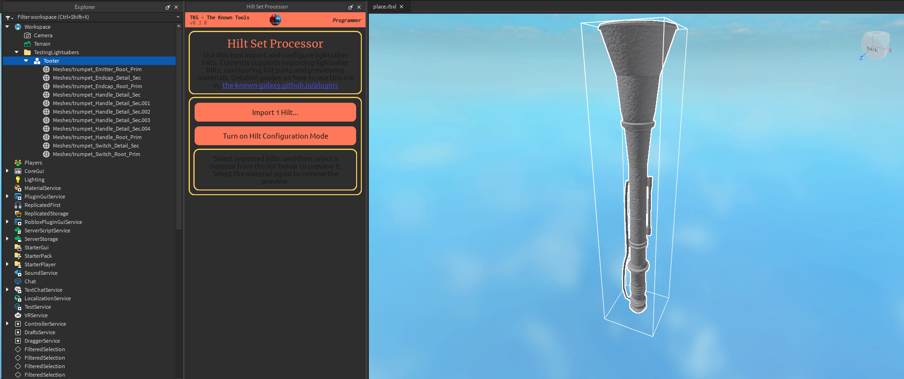

Here we see the `MeshPart`s all imported and parented under a single `Model` called _Tooter_.
Let's take a closer look:

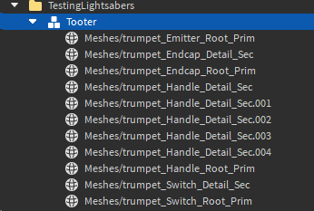

Notice how they are all named with the various selections of keywords.

Then, we click the `Import 1 Hilt...` button and the result is created 5 studs above it:

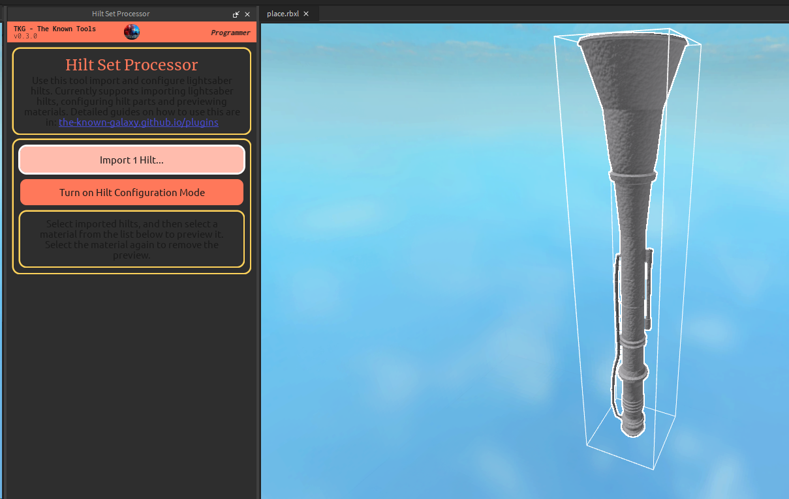
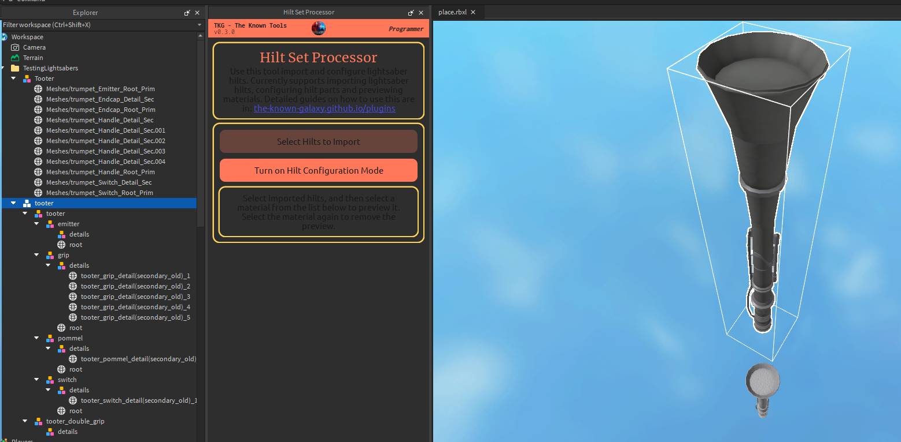

Notice the new structuring too.
The _Tooter_ hilt doesn't have a double handle so it doesn't have any actual parts go into it.

## Previewing Materials
Now that you've imported the lightsaber, you can preview materials on it to see how it would look in-game!
Simply select the imported hilt model at the root:

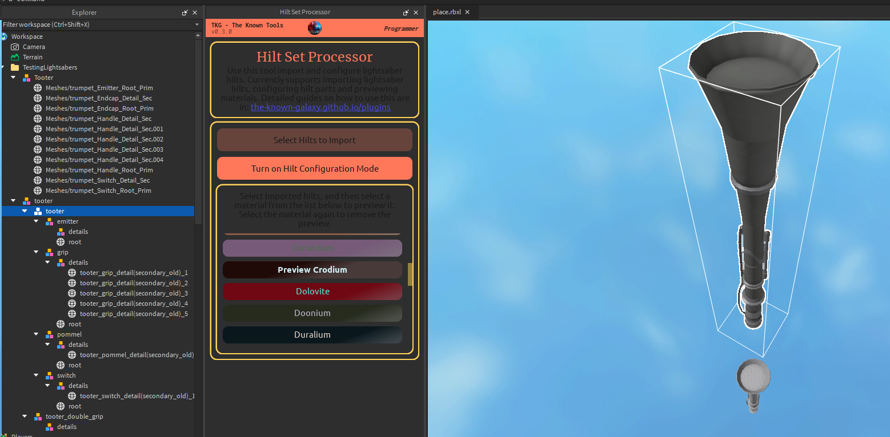
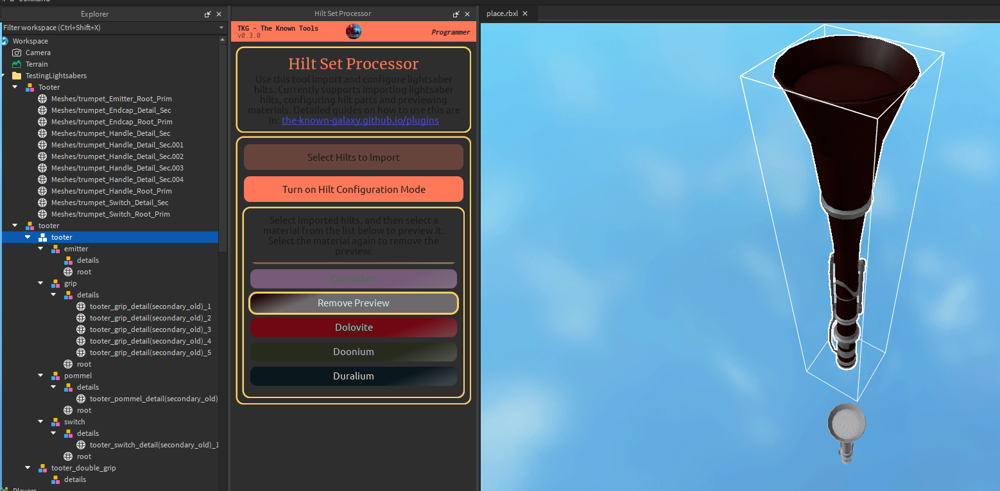

## Configuring Hilt Parts
If after importing, you realise some parts of the lightsaber were named incorrectly or you want to change what parts get influenced by the materials, then you can do that with **configuration mode**!

1. Enable Configuration Mode from the plugin.
	- This will remove your current selection of parts,
	- but will select them back later when you've disabled configuration mode.
2. Select a specific `BasePart` inside an imported hilt with **Left Mouse Button**.
3. Select one of the context options from the context menu that pops up.
4. Rinse and repeat until you're done making the changes you need.
5. Turn off configuration mode by toggling the button again.

Turning on:

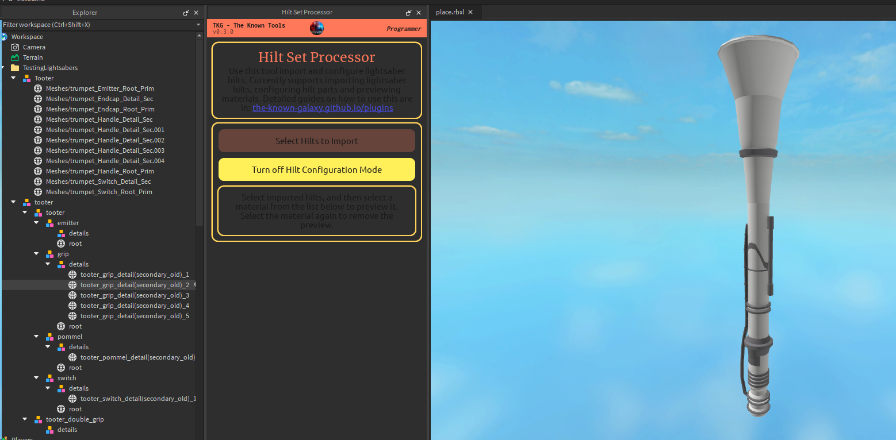

Selecting the fixed part to configure.

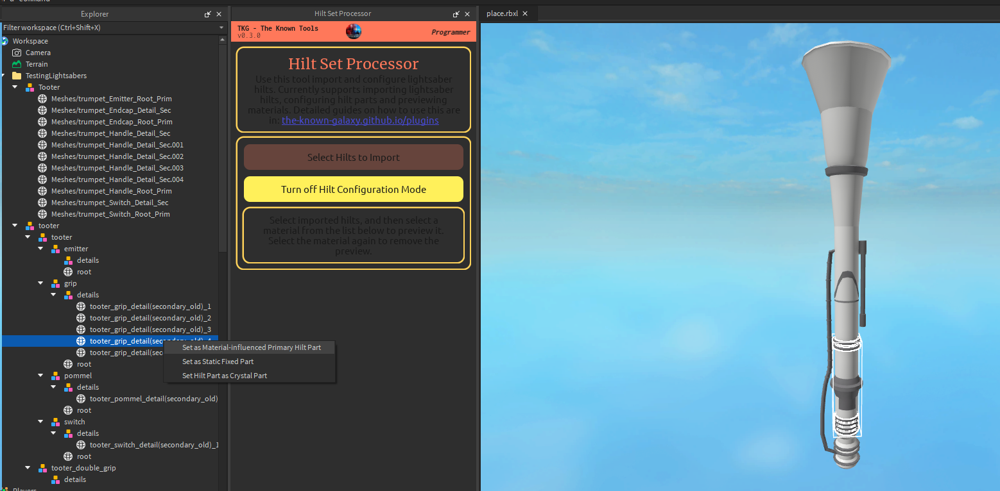

Closing configuration mode and previewing a material.

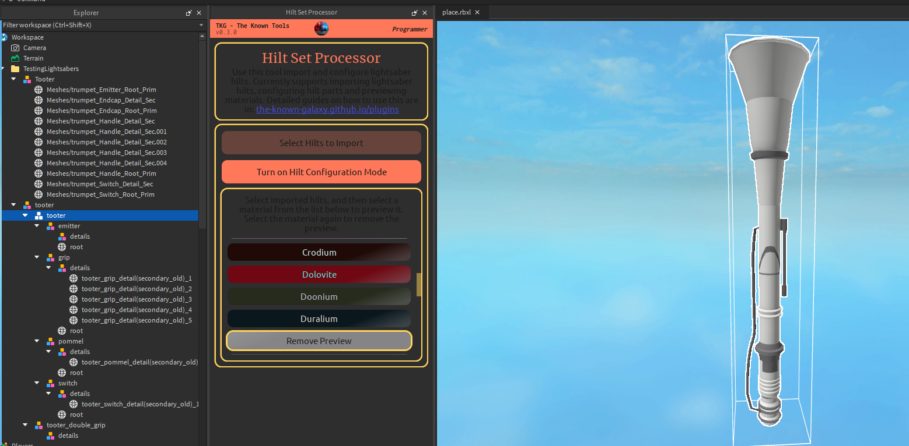

Notice how that part, since it's not a primary part instead of a fixed part, is now coloured white!

## Validating Hilts
Once you are done with importing/configuring a hilt, you may wish to validate it to ensure you have made no mistakes in editing it.
Doing this is as simple as:
1. Selecting the model(s) you wish to verify are correct lightsaber hilts.
2. Pressing the _"Validate x Hilts"_ button.
3. Reading the validation results from the **Output** (opened from `View > Show > Output` - 2nd column 1st item).

:::tip
Failed validations are highlighted in **orange** in the Output tab.
When they fail, they provide very _verbose_ descriptions taken directly from the raw validation outputs.
They are not the cleanest to read, but they provide the most accurate information to you in telling you what's wrong.

_Take your time reading them!_
:::

Here we see a validation succeeding:

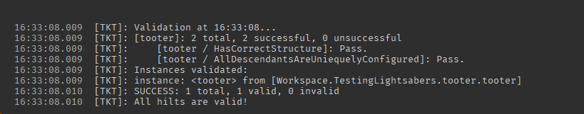

And here we see a validation failing:

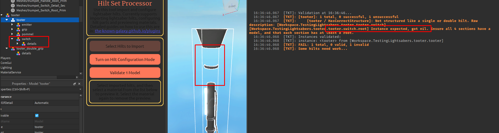

## Visualisation

### Root Parts
Since the root parts are the sole driving components that determine how the saber will be mounted on benches and held in hands, it is often useful to visualise the root parts exclusively.
Therefore, a utility for this purpose exists:

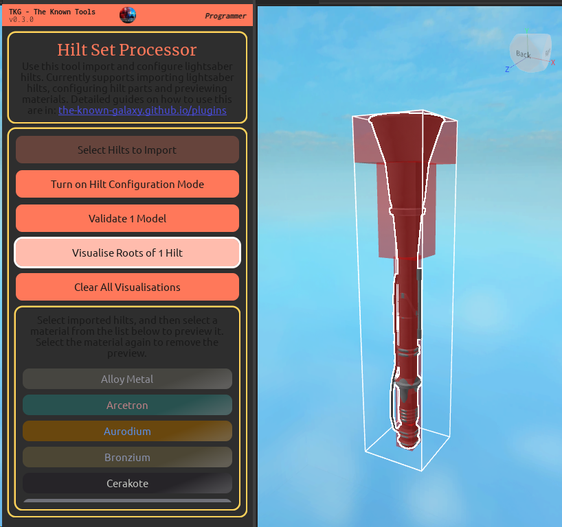